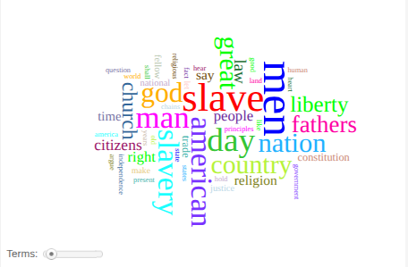



# Distant Reading Assignment 
Analysis: Frederick Douglass

For this project, I analyzed Frederick Douglass's speech using Voyant Tools and Microsoft Copilot. I used the same text for both tools to compare what each one could reveal about the speech. <https://www.neil.blog/full-speech-transcript/what-to-the-slave-is-the-fourth-of-july-by-frederick-douglass>

## Copilot Analysis

I asked Copilot to analyze the major themes in the speech and then asked it to analyze Douglass's rhetorical strategies, particularly his use of repetition, contrasts, rhetorical questions, and the pronouns “you” and “we.”

**Copilot Response:**

Repetition: Building Moral Pressure and Emotional Momentum
Douglass uses repetition to intensify his argument and to make certain ideas inescapable.

He repeats the idea that the holiday belongs to white Americans alone:
“This Fourth of July is yours, not mine. You may rejoice, I must mourn.”  
This repetition creates a rhythmic divide—every time he says “yours,” the audience is reminded of the exclusion.

He repeats the charge of national hypocrisy:
“Your celebration is a sham… your boasted liberty… your shouts of liberty and equality…”  
The repeated “your” becomes accusatory, hammering home the disconnect between ideals and reality.

He repeats the moral clarity of slavery’s evil:
“There is not a man beneath the canopy of heaven, that does not know that slavery is wrong for him.”  
Repetition here removes any pretense of ambiguity; the point is so obvious it cannot be debated.

Effect: Repetition creates a cumulative moral weight. Each recurrence tightens the argument until the audience cannot escape the conclusion: the nation’s celebration is fundamentally compromised.

## Voyant Analysis 

The Cirrus visualization shows “slave” as the most prominent word, followed by words such as “men,” “slavery,” “American,” “God,” “church,” “liberty,” “nation,” and “country.” These words reflect the speech's focus on slavery, freedom, religion, and American identity.

## Reflection 

Voyant was useful for showing patterns in the words used throughout the speech, while Copilot was able to interpret some of those patterns and identify larger themes and rhetorical strategies. Voyant cannot explain the meaning or context behind word frequencies and Copilot's interpretations were not always completely accurate. Both tools are useful for finding patterns and starting an analysis, but they still require examination of the original text and make your own judgments. This showed me that distant reading can make large amounts of text easier to analyze, but it works best alongside close reading.
